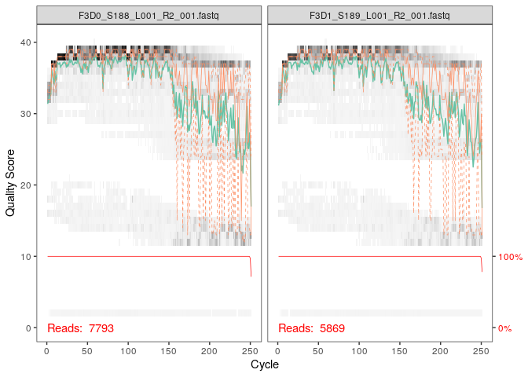
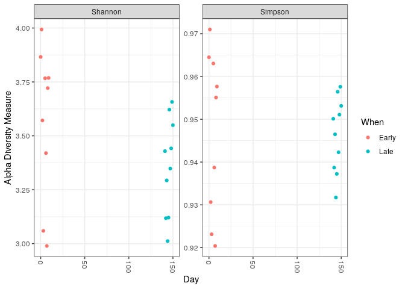

R Notebook
================

``` r
library(dada2); packageVersion("dada2")
```

    ## Loading required package: Rcpp

    ## [1] '1.28.0'

\#DADA2 search for sequencing errors and correct them so that to reduce
the number of unique sequences (genetic variance) obtained

\#In this line we indicate rstudio that we want to work with the
external package DADA2

``` r
path <- "/home/rstudio/DADA2/MiSeq_SOP"
list.files(path)
```

    ##  [1] "F3D0_S188_L001_R1_001.fastq"   "F3D0_S188_L001_R2_001.fastq"  
    ##  [3] "F3D1_S189_L001_R1_001.fastq"   "F3D1_S189_L001_R2_001.fastq"  
    ##  [5] "F3D141_S207_L001_R1_001.fastq" "F3D141_S207_L001_R2_001.fastq"
    ##  [7] "F3D142_S208_L001_R1_001.fastq" "F3D142_S208_L001_R2_001.fastq"
    ##  [9] "F3D143_S209_L001_R1_001.fastq" "F3D143_S209_L001_R2_001.fastq"
    ## [11] "F3D144_S210_L001_R1_001.fastq" "F3D144_S210_L001_R2_001.fastq"
    ## [13] "F3D145_S211_L001_R1_001.fastq" "F3D145_S211_L001_R2_001.fastq"
    ## [15] "F3D146_S212_L001_R1_001.fastq" "F3D146_S212_L001_R2_001.fastq"
    ## [17] "F3D147_S213_L001_R1_001.fastq" "F3D147_S213_L001_R2_001.fastq"
    ## [19] "F3D148_S214_L001_R1_001.fastq" "F3D148_S214_L001_R2_001.fastq"
    ## [21] "F3D149_S215_L001_R1_001.fastq" "F3D149_S215_L001_R2_001.fastq"
    ## [23] "F3D150_S216_L001_R1_001.fastq" "F3D150_S216_L001_R2_001.fastq"
    ## [25] "F3D2_S190_L001_R1_001.fastq"   "F3D2_S190_L001_R2_001.fastq"  
    ## [27] "F3D3_S191_L001_R1_001.fastq"   "F3D3_S191_L001_R2_001.fastq"  
    ## [29] "F3D5_S193_L001_R1_001.fastq"   "F3D5_S193_L001_R2_001.fastq"  
    ## [31] "F3D6_S194_L001_R1_001.fastq"   "F3D6_S194_L001_R2_001.fastq"  
    ## [33] "F3D7_S195_L001_R1_001.fastq"   "F3D7_S195_L001_R2_001.fastq"  
    ## [35] "F3D8_S196_L001_R1_001.fastq"   "F3D8_S196_L001_R2_001.fastq"  
    ## [37] "F3D9_S197_L001_R1_001.fastq"   "F3D9_S197_L001_R2_001.fastq"  
    ## [39] "filtered"                      "HMP_MOCK.v35.fasta"           
    ## [41] "Mock_S280_L001_R1_001.fastq"   "Mock_S280_L001_R2_001.fastq"  
    ## [43] "mouse.dpw.metadata"            "mouse.time.design"            
    ## [45] "stability.batch"               "stability.files"

``` r
#We named the path to specify a folder where the files that you want to list are located
#The list.files() function is to return a vector containing all the files names that are in our path
```

\#One file represent one sample with its respective primer used. In one
files more than one sequences (reads) will be present but of the same
length but of different quality. Some read will be unique while some
reads will be variances or sequencing errors.

``` r
fnFs <- sort(list.files(path, pattern="_R1_001.fastq", full.names = TRUE))

fnRs <- sort(list.files(path, pattern="_R2_001.fastq", full.names = TRUE))
sample.names <- sapply(strsplit(basename(fnFs), "_"), `[`, 1) #Extract sample names, assuming filenames have format: SAMPLENAME_XXX.fastq
```

\#We use the list.files() function to find all files within the “path”
that have the pattern “R1_001.fastq” in their name. The full.names =
TRUE argument ensures that the full path to each file is included in the
returned vector. The result is stored in the variable fnFs \#This is
extracting sample names: We use the sapply() function to apply the
strsplit() function to each element in the fnFs vector. strsplit()
splits each file name based on the underscore character. The first
element of each split is extracted using \[, 1\], and the resulting
vector of sample names is stored in the variable sample.names.

\#The reason why we’ve only applied sapply(strsplit(basename(fnFs),
“\_“),\[, 1) to fnFs and not to fnRs is because we’re assuming that the
sample names are consistent between the R1 and R2 reads. \#sapply(…,\[,
1): This applies the function \[, which extracts the first element of
each vector, to each element in the result of the strsplit operation.

``` r
#To inspect Inspect read (forward and reverse) quality profiles
plotQualityProfile(fnFs[1:2])
```

<!-- -->

``` r
plotQualityProfile(fnRs[1:2])
```

<!-- -->

``` r
#[1:2] means sample. We can view all the samples quality profile as well
```

\#Reverse reads are of significantly worse quality. This isn’t too
worrisome, as DADA2 incorporates quality information into its error
model which makes the algorithm robust to lower quality sequence, but
trimming as the average qualities crash will improve the algorithm’s
sensitivity to rare sequence variants.

\#Based on these profiles, we will truncate the reverse reads at
position 160 where the quality distribution crashes. \#Reads must still
overlap after truncation in order to merge them later

``` r
#Filter and trim
#Assign the filenames for the filtered fastq.gz files.
filtFs <- file.path(path, "filtered", paste0(sample.names, "_F_filt.fastq.gz"))
filtRs <- file.path(path, "filtered", paste0(sample.names, "_R_filt.fastq.gz")) #Place filtered files in filtered/subdirectory
names(filtFs) <- sample.names
names(filtRs) <- sample.names
```

``` r
out <- filterAndTrim(fnFs, filtFs, fnRs, filtRs, truncLen=c(240,160),
              maxN=0, maxEE=c(2,2), truncQ=2, rm.phix=TRUE,
              compress=TRUE, multithread=FALSE)
head(out)
```

    ##                               reads.in reads.out
    ## F3D0_S188_L001_R1_001.fastq       7793      7113
    ## F3D1_S189_L001_R1_001.fastq       5869      5299
    ## F3D141_S207_L001_R1_001.fastq     5958      5463
    ## F3D142_S208_L001_R1_001.fastq     3183      2914
    ## F3D143_S209_L001_R1_001.fastq     3178      2941
    ## F3D144_S210_L001_R1_001.fastq     4827      4312

``` r
#The filterAndTrim() function from the DADA2 package is being used to filter and trim the fastq files. This step removes low-quality reads and trims the reads to a specific position.

#reads.in: The number of reads in the original file.
#reads.out: The number of reads that passed the filtering and trimming steps.


#The out <- filterAndTrim(fnFs, filtFs, fnRs, filtRs, truncLen=c(240,160)) line in the DADA2 package is used to filter and trim paired-end fastq files. Here's a breakdown of the arguments:

#fnFs: A vector of file names for the forward reads.
#filtFs: A vector of file names for the filtered forward reads.
#fnRs: A vector of file names for the reverse reads.
#filtRs: A vector of file names for the filtered reverse reads.
#truncLen: A vector of two integers specifying the truncation lengths for the forward and reverse reads, respectively. In this case, the forward reads will be truncated to 240 base pairs and the reverse reads will be truncated to 160 base pairs.

#The filterAndTrim() function performs the following steps: 1)Filters reads: It removes low-quality reads based on their quality scores. 2)Trims reads: It trims the reads to the specified truncation lengths. 3) Writes filtered reads: It writes the filtered reads to the files specified in filtFs and filtRs.
```

\#Learn the Error Rates

\#Error raterefers to the estimated rate at which sequencing errors
occur in the raw sequencing data. These errors can arise from various
factors, such as instrument noise, chemical reactions, and sample
preparation issues.

``` r
errF <- learnErrors(filtFs, multithread=TRUE)
```

    ## 33514080 total bases in 139642 reads from 20 samples will be used for learning the error rates.

``` r
#The learnErrors() function estimates the error rates for each base position in the filtered reads. This information is used by DADA2 to denoise the data and assign reads to OTUs.
#multithread=TRUE: This argument specifies that the function should use multiple threads to speed up the computation.
```

``` r
errR <- learnErrors(filtRs, multithread=TRUE)
```

    ## 22342720 total bases in 139642 reads from 20 samples will be used for learning the error rates.

``` r
# Following this analysis we obtain in the environment next to the errR vector "list of 3". The "List of 3" in the context of the DADA2 refers to the three main output objects created during the error rate learning process: 1) errR: This object contains the estimated error rates for each base position in the filtered reads. It is a matrix where each row corresponds to a base position and each column corresponds to a different nucleotide (A, C, G, or T). The values in the matrix represent the probability of a sequencing error occurring at that specific base position. 2) filts: This object is a character vector containing the file paths of the filtered reads. These files are used as input for subsequent steps in the DADA2 pipeline. 3) fnRs: This object is a character vector containing the file paths of the reverse reads. These files are used in conjunction with the forward reads (stored in filts) for paired-end sequencing data. These three objects are essential for the denoising and OTU assignment steps in the DADA2 pipeline, as they provide the necessary information about the sequencing error rates and the filtered read data.
```

``` r
plotErrors(errF, nominalQ=TRUE) #to visualize the estimated error rates
```

    ## Warning: Transformation introduced infinite values in continuous y-axis
    ## Transformation introduced infinite values in continuous y-axis

<!-- -->

\#Sample Inference Analysis

``` r
dadaFs <- dada(filtFs, err=errF, multithread=TRUE)
```

    ## Sample 1 - 7113 reads in 1979 unique sequences.
    ## Sample 2 - 5299 reads in 1639 unique sequences.
    ## Sample 3 - 5463 reads in 1477 unique sequences.
    ## Sample 4 - 2914 reads in 904 unique sequences.
    ## Sample 5 - 2941 reads in 939 unique sequences.
    ## Sample 6 - 4312 reads in 1267 unique sequences.
    ## Sample 7 - 6741 reads in 1756 unique sequences.
    ## Sample 8 - 4560 reads in 1438 unique sequences.
    ## Sample 9 - 15637 reads in 3590 unique sequences.
    ## Sample 10 - 11413 reads in 2762 unique sequences.
    ## Sample 11 - 12017 reads in 3021 unique sequences.
    ## Sample 12 - 5032 reads in 1566 unique sequences.
    ## Sample 13 - 18075 reads in 3707 unique sequences.
    ## Sample 14 - 6250 reads in 1479 unique sequences.
    ## Sample 15 - 4052 reads in 1195 unique sequences.
    ## Sample 16 - 7369 reads in 1832 unique sequences.
    ## Sample 17 - 4765 reads in 1183 unique sequences.
    ## Sample 18 - 4871 reads in 1382 unique sequences.
    ## Sample 19 - 6504 reads in 1709 unique sequences.
    ## Sample 20 - 4314 reads in 897 unique sequences.

``` r
dadaRs <- dada(filtRs, err=errR, multithread=TRUE)
```

    ## Sample 1 - 7113 reads in 1660 unique sequences.
    ## Sample 2 - 5299 reads in 1349 unique sequences.
    ## Sample 3 - 5463 reads in 1335 unique sequences.
    ## Sample 4 - 2914 reads in 853 unique sequences.
    ## Sample 5 - 2941 reads in 880 unique sequences.
    ## Sample 6 - 4312 reads in 1286 unique sequences.
    ## Sample 7 - 6741 reads in 1803 unique sequences.
    ## Sample 8 - 4560 reads in 1265 unique sequences.
    ## Sample 9 - 15637 reads in 3414 unique sequences.
    ## Sample 10 - 11413 reads in 2522 unique sequences.
    ## Sample 11 - 12017 reads in 2771 unique sequences.
    ## Sample 12 - 5032 reads in 1415 unique sequences.
    ## Sample 13 - 18075 reads in 3290 unique sequences.
    ## Sample 14 - 6250 reads in 1390 unique sequences.
    ## Sample 15 - 4052 reads in 1134 unique sequences.
    ## Sample 16 - 7369 reads in 1635 unique sequences.
    ## Sample 17 - 4765 reads in 1084 unique sequences.
    ## Sample 18 - 4871 reads in 1161 unique sequences.
    ## Sample 19 - 6504 reads in 1502 unique sequences.
    ## Sample 20 - 4314 reads in 732 unique sequences.

``` r
#Ssample inference in DADA2 refers to the process of analyzing sequence data to identify and quantify unique biological sequences (OTUs or ASVs) within a sample. It's a crucial step in understanding the microbial diversity present in a given environment.

#Sample ID: Each row represents a different sample.
#Reads: The total number of sequencing reads obtained for that sample.
#Unique sequences: The number of distinct DNA sequences identified within the sample.
#This information provides a basic overview of the sequencing depth and diversity observed in each sample.

#The DADA2 uses a statistical model to group similar sequences together, assuming that differences between sequences are due to sequencing errors rather than biological variation. This process helps to reduce the number of unique sequences and makes it easier to identify and analyze the dominant microbial populations in the sample. In summary, sample inference in DADA2 is essential for understanding the microbial composition of a sample and for making inferences about the ecological processes occurring within that environment.
```

\#The results obtained mean that for each sample (example sample 1,
forward) there are 7113 reads (sequences) in which 1979 are unique
sequences (that is occur only once) \#The more a species will be present
in the sample the more its sequence will be present in the sequencing
results. Variance of this species will be considered as other sequences
and will form their own OTU.

\#Inspecting the returned dada-class object:

``` r
dadaFs[[1]]
```

    ## dada-class: object describing DADA2 denoising results
    ## 128 sequence variants were inferred from 1979 input unique sequences.
    ## Key parameters: OMEGA_A = 1e-40, OMEGA_C = 1e-40, BAND_SIZE = 16

# 1979 input unique sequences: Refers to the total number of unique DNA sequences that were initially identified in the sample after filtering and trimming.

\#128 sequence variants: DADA2 grouped these unique sequences into 128
clusters based on their similarity and the estimated error rates. Each
cluster represents a unique biological sequence.

``` r
help("dada-class")
```

\#Merge paired reads \#Merge the forward and reverse reads together to
obtain the full denoised sequences (constructing the merged “contig”
sequences). By default, merged sequences are only output if the forward
and reverse reads overlap by at least 12 bases, and are identical to
each other in the overlap region (these conditions can be changed via
function arguments).

``` r
mergers <- mergePairs(dadaFs, filtFs, dadaRs, filtRs, verbose=TRUE) #Paired reads that did not exactly overlap were removed by mergePairs, further reducing spurious output.
```

    ## 6540 paired-reads (in 107 unique pairings) successfully merged out of 6891 (in 197 pairings) input.

    ## 5028 paired-reads (in 101 unique pairings) successfully merged out of 5190 (in 157 pairings) input.

    ## 4986 paired-reads (in 81 unique pairings) successfully merged out of 5267 (in 166 pairings) input.

    ## 2595 paired-reads (in 52 unique pairings) successfully merged out of 2754 (in 108 pairings) input.

    ## 2553 paired-reads (in 60 unique pairings) successfully merged out of 2785 (in 119 pairings) input.

    ## 3646 paired-reads (in 55 unique pairings) successfully merged out of 4109 (in 157 pairings) input.

    ## 6079 paired-reads (in 81 unique pairings) successfully merged out of 6514 (in 198 pairings) input.

    ## 3968 paired-reads (in 91 unique pairings) successfully merged out of 4388 (in 187 pairings) input.

    ## 14233 paired-reads (in 143 unique pairings) successfully merged out of 15355 (in 352 pairings) input.

    ## 10528 paired-reads (in 120 unique pairings) successfully merged out of 11165 (in 278 pairings) input.

    ## 11154 paired-reads (in 137 unique pairings) successfully merged out of 11797 (in 298 pairings) input.

    ## 4349 paired-reads (in 85 unique pairings) successfully merged out of 4802 (in 179 pairings) input.

    ## 17431 paired-reads (in 153 unique pairings) successfully merged out of 17812 (in 272 pairings) input.

    ## 5850 paired-reads (in 81 unique pairings) successfully merged out of 6095 (in 159 pairings) input.

    ## 3716 paired-reads (in 86 unique pairings) successfully merged out of 3894 (in 147 pairings) input.

    ## 6865 paired-reads (in 99 unique pairings) successfully merged out of 7191 (in 187 pairings) input.

    ## 4426 paired-reads (in 67 unique pairings) successfully merged out of 4603 (in 127 pairings) input.

    ## 4576 paired-reads (in 101 unique pairings) successfully merged out of 4739 (in 174 pairings) input.

    ## 6092 paired-reads (in 109 unique pairings) successfully merged out of 6315 (in 173 pairings) input.

    ## 4269 paired-reads (in 20 unique pairings) successfully merged out of 4281 (in 28 pairings) input.

``` r
# Inspect the merger data.frame from the first sample
head(mergers[[1]])
```

    ##                                                                                                                                                                                                                                                       sequence
    ## 1 TACGGAGGATGCGAGCGTTATCCGGATTTATTGGGTTTAAAGGGTGCGCAGGCGGAAGATCAAGTCAGCGGTAAAATTGAGAGGCTCAACCTCTTCGAGCCGTTGAAACTGGTTTTCTTGAGTGAGCGAGAAGTATGCGGAATGCGTGGTGTAGCGGTGAAATGCATAGATATCACGCAGAACTCCGATTGCGAAGGCAGCATACCGGCGCTCAACTGACGCTCATGCACGAAAGTGTGGGTATCGAACAGG
    ## 2 TACGGAGGATGCGAGCGTTATCCGGATTTATTGGGTTTAAAGGGTGCGTAGGCGGCCTGCCAAGTCAGCGGTAAAATTGCGGGGCTCAACCCCGTACAGCCGTTGAAACTGCCGGGCTCGAGTGGGCGAGAAGTATGCGGAATGCGTGGTGTAGCGGTGAAATGCATAGATATCACGCAGAACCCCGATTGCGAAGGCAGCATACCGGCGCCCTACTGACGCTGAGGCACGAAAGTGCGGGGATCAAACAGG
    ## 3 TACGGAGGATGCGAGCGTTATCCGGATTTATTGGGTTTAAAGGGTGCGTAGGCGGGCTGTTAAGTCAGCGGTCAAATGTCGGGGCTCAACCCCGGCCTGCCGTTGAAACTGGCGGCCTCGAGTGGGCGAGAAGTATGCGGAATGCGTGGTGTAGCGGTGAAATGCATAGATATCACGCAGAACTCCGATTGCGAAGGCAGCATACCGGCGCCCGACTGACGCTGAGGCACGAAAGCGTGGGTATCGAACAGG
    ## 4 TACGGAGGATGCGAGCGTTATCCGGATTTATTGGGTTTAAAGGGTGCGTAGGCGGGCTTTTAAGTCAGCGGTAAAAATTCGGGGCTCAACCCCGTCCGGCCGTTGAAACTGGGGGCCTTGAGTGGGCGAGAAGAAGGCGGAATGCGTGGTGTAGCGGTGAAATGCATAGATATCACGCAGAACCCCGATTGCGAAGGCAGCCTTCCGGCGCCCTACTGACGCTGAGGCACGAAAGTGCGGGGATCGAACAGG
    ## 5 TACGGAGGATGCGAGCGTTATCCGGATTTATTGGGTTTAAAGGGTGCGCAGGCGGACTCTCAAGTCAGCGGTCAAATCGCGGGGCTCAACCCCGTTCCGCCGTTGAAACTGGGAGCCTTGAGTGCGCGAGAAGTAGGCGGAATGCGTGGTGTAGCGGTGAAATGCATAGATATCACGCAGAACTCCGATTGCGAAGGCAGCCTACCGGCGCGCAACTGACGCTCATGCACGAAAGCGTGGGTATCGAACAGG
    ## 6 TACGGAGGATGCGAGCGTTATCCGGATTTATTGGGTTTAAAGGGTGCGTAGGCGGGATGCCAAGTCAGCGGTAAAAAAGCGGTGCTCAACGCCGTCGAGCCGTTGAAACTGGCGTTCTTGAGTGGGCGAGAAGTATGCGGAATGCGTGGTGTAGCGGTGAAATGCATAGATATCACGCAGAACTCCGATTGCGAAGGCAGCATACCGGCGCCCTACTGACGCTGAGGCACGAAAGCGTGGGTATCGAACAGG
    ##   abundance forward reverse nmatch nmismatch nindel prefer accept
    ## 1       579       1       1    148         0      0      1   TRUE
    ## 2       470       2       2    148         0      0      2   TRUE
    ## 3       449       3       4    148         0      0      1   TRUE
    ## 4       430       4       3    148         0      0      2   TRUE
    ## 5       345       5       6    148         0      0      1   TRUE
    ## 6       282       6       5    148         0      0      2   TRUE

\#Construct sequence table \#Construction an amplicon sequence variant
table (ASV) table, a higher-resolution version of the OTU table produced
by traditional methods.

``` r
seqtab <- makeSequenceTable(mergers)
dim(seqtab)
```

    ## [1]  20 293

``` r
# Inspect distribution of sequence lengths
table(nchar(getSequences(seqtab)))
```

    ## 
    ## 251 252 253 254 255 
    ##   1  88 196   6   2

\#The sequence table is a matrix with rows corresponding to (and named
by) the samples, and columns corresponding to (and named by) the
sequence variants. This table contains 293 ASVs, and the lengths of our
merged sequences all fall within the expected range for this V4 amplicon

\#The sequence table summarizes the identified unique sequences (ASVs)
and their abundance in the sample. It provides a fundamental overview of
the microbial diversity and composition.

\#Remove chimeras \#The core dada method corrects substitution and indel
errors, but chimeras remain. Fortunately, the accuracy of sequence
variants after denoising makes identifying chimeric ASVs simpler.
Chimeric sequences are identified if they can be exactly reconstructed
by combining a left-segment and a right-segment from two more abundant
“parent” sequences.

``` r
seqtab.nochim <- removeBimeraDenovo(seqtab, method="consensus", multithread=TRUE, verbose=TRUE)
```

    ## Identified 61 bimeras out of 293 input sequences.

``` r
dim(seqtab.nochim)
```

    ## [1]  20 232

\#The frequency of chimeric sequences \#The frequency of chimeric
sequences varies substantially from dataset to dataset, and depends on
on factors including experimental procedures and sample complexity.

``` r
sum(seqtab.nochim)/sum(seqtab)
```

    ## [1] 0.9640374

\#Here chimeras make up about 21% of the merged sequence variants, but
when account for the abundances of those variants we see they account
for only about 4% of the merged sequence reads.

\#Cautions : Most of your reads should remain after chimera removal (it
is not uncommon for a majority of sequence variants to be removed
though). If most of your reads were removed as chimeric, upstream
processing may need to be revisited. In almost all cases this is caused
by primer sequences with ambiguous nucleotides that were not removed
prior to beginning the DADA2 pipeline.

\#Track reads through the pipeline \#look at the number of reads that
made it through each step in the pipeline

``` r
getN <- function(x) sum(getUniques(x))
track <- cbind(out, sapply(dadaFs, getN), sapply(dadaRs, getN), sapply(mergers, getN), rowSums(seqtab.nochim))
# If processing a single sample, remove the sapply calls: e.g. replace sapply(dadaFs, getN) with getN(dadaFs)
colnames(track) <- c("input", "filtered", "denoisedF", "denoisedR", "merged", "nonchim")
rownames(track) <- sample.names
head(track)
```

    ##        input filtered denoisedF denoisedR merged nonchim
    ## F3D0    7793     7113      6976      6979   6540    6528
    ## F3D1    5869     5299      5227      5239   5028    5017
    ## F3D141  5958     5463      5331      5357   4986    4863
    ## F3D142  3183     2914      2799      2830   2595    2521
    ## F3D143  3178     2941      2822      2868   2553    2519
    ## F3D144  4827     4312      4151      4228   3646    3507

\#Input: The total number of reads originally present in the sample
before any processing. \#Filtered: The number of reads remaining after
filtering out low-quality reads based on quality scores. \#Denoisedf:
The number of reads remaining after denoising the forward reads (using
the estimated error rates). \#Denoisedr: The number of reads remaining
after denoising the reverse reads (using the estimated error rates).
\#Merged: The number of reads that were successfully merged from
paired-end sequencing data (if applicable). \#Nonchim: The number of
reads that were not assigned to any chimeric sequence (potential
artifacts resulting from PCR errors).

\#Assign taxonomy \#The DADA2 package provides a native implementation
of the naive Bayesian classifier method for this purpose. The
assignTaxonomy function takes as input a set of sequences to be
classified and a training set of reference sequences with known
taxonomy, and outputs taxonomic assignments with at least minBoot
bootstrap confidence. \#We maintain formatted training fastas for the
RDP training set, GreenGenes clustered at 97% identity, and the Silva
reference database, and additional trainings fastas suitable for
protists and certain specific environments have been contributed. For
fungal taxonomy, the General Fasta release files from the UNITE ITS
database can be used as is. \#To follow along, download the
silva_nr_v132_train_set.fa.gz file, and place it in the directory with
the fastq files.

``` r
taxa <- assignTaxonomy(seqtab.nochim, "/home/rstudio/DADA2/silva_nr_v132_train_set.fa.gz?download=1", multithread=TRUE)
```

\#inspect the taxonomic assignments:

``` r
taxa.print <- taxa # Removing sequence rownames for display only
rownames(taxa.print) <- NULL
head(taxa.print)
```

    ##      Kingdom    Phylum          Class         Order           Family          
    ## [1,] "Bacteria" "Bacteroidetes" "Bacteroidia" "Bacteroidales" "Muribaculaceae"
    ## [2,] "Bacteria" "Bacteroidetes" "Bacteroidia" "Bacteroidales" "Muribaculaceae"
    ## [3,] "Bacteria" "Bacteroidetes" "Bacteroidia" "Bacteroidales" "Muribaculaceae"
    ## [4,] "Bacteria" "Bacteroidetes" "Bacteroidia" "Bacteroidales" "Muribaculaceae"
    ## [5,] "Bacteria" "Bacteroidetes" "Bacteroidia" "Bacteroidales" "Bacteroidaceae"
    ## [6,] "Bacteria" "Bacteroidetes" "Bacteroidia" "Bacteroidales" "Muribaculaceae"
    ##      Genus        
    ## [1,] NA           
    ## [2,] NA           
    ## [3,] NA           
    ## [4,] NA           
    ## [5,] "Bacteroides"
    ## [6,] NA

\#nsurprisingly, the Bacteroidetes are well represented among the most
abundant taxa in these fecal samples. Few species assignments were made,
both because it is often not possible to make unambiguous species
assignments from subsegments of the 16S gene, and because there is
surprisingly little coverage of the indigenous mouse gut microbiota in
reference databases.

``` r
unqs.mock <- seqtab.nochim["Mock",]
unqs.mock <- sort(unqs.mock[unqs.mock>0], decreasing=TRUE) # Drop ASVs absent in the Mock
cat("DADA2 inferred", length(unqs.mock), "sample sequences present in the Mock community.\n")
```

    ## DADA2 inferred 20 sample sequences present in the Mock community.

# A mock community is a synthetic mixture of known strains of bacteria. It serves as a controlled experiment because the exact composition is known, allowing for direct comparison between the inferred results and the ground truth. By comparing the inferred sequence variants from the mock community to the expected composition, we can evaluate how well DADA2 performs in terms of identifying and quantifying different bacterial species.

\#The evaluation aims to determine the accuracy of DADA2 in identifying
the correct sequence variants and their abundances. Error rate
calculation: By comparing the inferred results to the known composition
of the mock community, the error rate of the DADA2 pipeline can be
calculated. The results obtained from the evaluation can be compared to
those of other microbiome analysis methods to assess DADA2’s performance
relative to other tools.

``` r
mock.ref <- getSequences(file.path(path, "HMP_MOCK.v35.fasta"))
match.ref <- sum(sapply(names(unqs.mock), function(x) any(grepl(x, mock.ref))))
cat("Of those,", sum(match.ref), "were exact matches to the expected reference sequences.\n")
```

    ## Of those, 20 were exact matches to the expected reference sequences.

\#This mock community contained 20 bacterial strains. DADA2 identified
20 ASVs all of which exactly match the reference genomes of the expected
community members. The residual error rate after the DADA2 pipeline for
this sample is 0%.

\#Optional Analysis# phyloseq

\#preparation of data for phyloseq

``` r
library(phyloseq); packageVersion("phyloseq")
```

    ## [1] '1.44.0'

``` r
library(Biostrings); packageVersion("Biostrings")
```

    ## Loading required package: BiocGenerics

    ## 
    ## Attaching package: 'BiocGenerics'

    ## The following objects are masked from 'package:stats':
    ## 
    ##     IQR, mad, sd, var, xtabs

    ## The following objects are masked from 'package:base':
    ## 
    ##     anyDuplicated, aperm, append, as.data.frame, basename, cbind,
    ##     colnames, dirname, do.call, duplicated, eval, evalq, Filter, Find,
    ##     get, grep, grepl, intersect, is.unsorted, lapply, Map, mapply,
    ##     match, mget, order, paste, pmax, pmax.int, pmin, pmin.int,
    ##     Position, rank, rbind, Reduce, rownames, sapply, setdiff, sort,
    ##     table, tapply, union, unique, unsplit, which.max, which.min

    ## Loading required package: S4Vectors

    ## Loading required package: stats4

    ## 
    ## Attaching package: 'S4Vectors'

    ## The following object is masked from 'package:utils':
    ## 
    ##     findMatches

    ## The following objects are masked from 'package:base':
    ## 
    ##     expand.grid, I, unname

    ## Loading required package: IRanges

    ## 
    ## Attaching package: 'IRanges'

    ## The following object is masked from 'package:phyloseq':
    ## 
    ##     distance

    ## Loading required package: XVector

    ## Loading required package: GenomeInfoDb

    ## 
    ## Attaching package: 'Biostrings'

    ## The following object is masked from 'package:base':
    ## 
    ##     strsplit

    ## [1] '2.68.1'

``` r
library(ggplot2); packageVersion("ggplot2")
```

    ## [1] '3.4.3'

``` r
theme_set(theme_bw()) #The theme_set(theme_bw()) function in R's ggplot2 package sets the default theme for all subsequent plots to the "bw" theme. This theme is characterized by a white background, black text, and a minimalist aesthetic.
```

# construction of a simple sample data.frame from the information encoded in the filenames

``` r
samples.out <- rownames(seqtab.nochim)
subject <- sapply(strsplit(samples.out, "D"), `[`, 1)
gender <- substr(subject,1,1)
subject <- substr(subject,2,999)
day <- as.integer(sapply(strsplit(samples.out, "D"), `[`, 2))
samdf <- data.frame(Subject=subject, Gender=gender, Day=day)
samdf$When <- "Early"
samdf$When[samdf$Day>100] <- "Late"
rownames(samdf) <- samples.out
```

\#now construct a phyloseq object directly from the dada2 outputs.

``` r
ps <- phyloseq(otu_table(seqtab.nochim, taxa_are_rows=FALSE), 
               sample_data(samdf), 
               tax_table(taxa))
ps <- prune_samples(sample_names(ps) != "Mock", ps) # Remove mock sample
```

\#It is more convenient to use short names for our ASVs (e.g. ASV21)
rather than the full DNA sequence when working with some of the tables
and visualizations from phyloseq, but we want to keep the full DNA
sequences for other purposes like merging with other datasets or
indexing into reference databases like the Earth Microbiome Project. For
that reason we’ll store the DNA sequences of our ASVs in the refseq slot
of the phyloseq object, and then rename our taxa to a short string. That
way, the short new taxa names will appear in tables and plots, and we
can still recover the DNA sequences corresponding to each ASV as needed
with refseq(ps).

``` r
dna <- Biostrings::DNAStringSet(taxa_names(ps))
names(dna) <- taxa_names(ps)
ps <- merge_phyloseq(ps, dna)
taxa_names(ps) <- paste0("ASV", seq(ntaxa(ps)))
ps
```

    ## phyloseq-class experiment-level object
    ## otu_table()   OTU Table:         [ 232 taxa and 19 samples ]
    ## sample_data() Sample Data:       [ 19 samples by 4 sample variables ]
    ## tax_table()   Taxonomy Table:    [ 232 taxa by 6 taxonomic ranks ]
    ## refseq()      DNAStringSet:      [ 232 reference sequences ]

\#end of data preparation for phyloseq analysis. Now we proceed with the
phyloseq analysis.

\#Visualize alpha-diversity:

``` r
plot_richness(ps, x="Day", measures=c("Shannon", "Simpson"), color="When")
```

    ## Warning in estimate_richness(physeq, split = TRUE, measures = measures): The data you have provided does not have
    ## any singletons. This is highly suspicious. Results of richness
    ## estimates (for example) are probably unreliable, or wrong, if you have already
    ## trimmed low-abundance taxa from the data.
    ## 
    ## We recommended that you find the un-trimmed data and retry.

<!-- --> \#the y-axis
represents the alpha diversity index \#Observation : No obvious
systematic difference in alpha-diversity between early and late samples.
\#Based on the plots, there seems to be no obvious systematic difference
in alpha diversity between the early and late samples. This suggests
that the microbial communities in the samples are similarly diverse,
regardless of the time point.

\#Alpha diversity is a measure of the diversity of species within a
given community or habitat. It reflects the richness (the number of
different species) and evenness (the relative abundance of each species)
within a sample. \#Two common alpha diversity indices are: 1) Shannon
index: Measures both richness and evenness. A higher Shannon index
indicates a more diverse community. 2) Simpson index: Primarily measures
richness. A higher Simpson index indicates a more diverse community, but
it is less sensitive to evenness than the Shannon index.

\#Ordinate

\#Ordination is a statistical technique used to visualize the
relationships between samples or objects based on their similarity or
dissimilarity. It is used in ecology to understand the structure and
patterns within a dataset. For microbiome analysis, ordination is used
to visualize the differences between microbial communities. By plotting
the samples in a low-dimensional space, ordination can help identify
groups of samples with similar microbial compositions and reveal the
underlying factors driving these differences.

``` r
# Transform data to proportions as appropriate for Bray-Curtis distances
ps.prop <- transform_sample_counts(ps, function(otu) otu/sum(otu))
ord.nmds.bray <- ordinate(ps.prop, method="NMDS", distance="bray")
```

    ## Run 0 stress 0.08043117 
    ## Run 1 stress 0.09477195 
    ## Run 2 stress 0.08076337 
    ## ... Procrustes: rmse 0.01051395  max resid 0.03236004 
    ## Run 3 stress 0.08076336 
    ## ... Procrustes: rmse 0.01048988  max resid 0.03228157 
    ## Run 4 stress 0.08616061 
    ## Run 5 stress 0.08076339 
    ## ... Procrustes: rmse 0.01054378  max resid 0.03245748 
    ## Run 6 stress 0.08616061 
    ## Run 7 stress 0.0807634 
    ## ... Procrustes: rmse 0.01056411  max resid 0.03252389 
    ## Run 8 stress 0.09477217 
    ## Run 9 stress 0.08043117 
    ## ... Procrustes: rmse 1.117231e-06  max resid 2.738261e-06 
    ## ... Similar to previous best
    ## Run 10 stress 0.08076337 
    ## ... Procrustes: rmse 0.01051586  max resid 0.03236623 
    ## Run 11 stress 0.08076338 
    ## ... Procrustes: rmse 0.01049218  max resid 0.03228832 
    ## Run 12 stress 0.1212044 
    ## Run 13 stress 0.08616061 
    ## Run 14 stress 0.09477173 
    ## Run 15 stress 0.08616061 
    ## Run 16 stress 0.1334791 
    ## Run 17 stress 0.08076336 
    ## ... Procrustes: rmse 0.0104718  max resid 0.03222281 
    ## Run 18 stress 0.135815 
    ## Run 19 stress 0.101063 
    ## Run 20 stress 0.09477207 
    ## *** Best solution repeated 1 times

``` r
plot_ordination(ps.prop, ord.nmds.bray, color="When", title="Bray NMDS")
```

<!-- --> \#Ordination
picks out a clear separation between the early and late samples.

\#The plot is a Bray-Curtis NMDS plot, which visualizes the
relationships between microbial communities based on their similarity or
dissimilarity. \#Each point: Represents a microbial community sample.
\#Position of points: The closer two points are on the plot, the more
similar their microbial compositions are. \#Clustering: If points are
clustered together, it indicates that those samples share similar
microbial characteristics. \#Separation: In this case, the early and
late samples are clearly separated, suggesting that they have distinct
microbial profiles.

\#Bar plot:

``` r
top20 <- names(sort(taxa_sums(ps), decreasing=TRUE))[1:20]
ps.top20 <- transform_sample_counts(ps, function(OTU) OTU/sum(OTU))
ps.top20 <- prune_taxa(top20, ps.top20)
plot_bar(ps.top20, x="Day", fill="Family") + facet_wrap(~When, scales="free_x")
```

<!-- --> \#Result:
Nothing glaringly obvious jumps out from the taxonomic distribution of
the top 20 sequences to explain the early-late differentiation.
